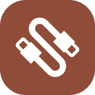

# USBKIT

> Use rooted Android device as wired composite device of Storage, HID, ADB, RNDIS, Camera, etc. and utilized.

## License

Licensed under the [GPL-3.0](https://www.gnu.org/licenses/gpl-3.0.html) License.
